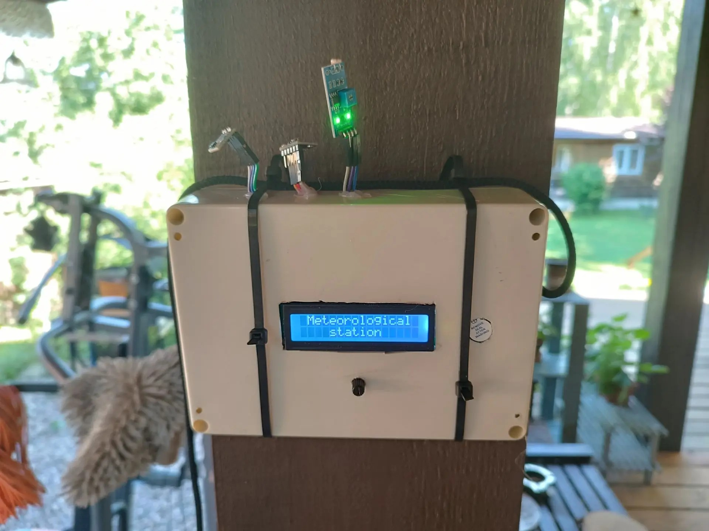
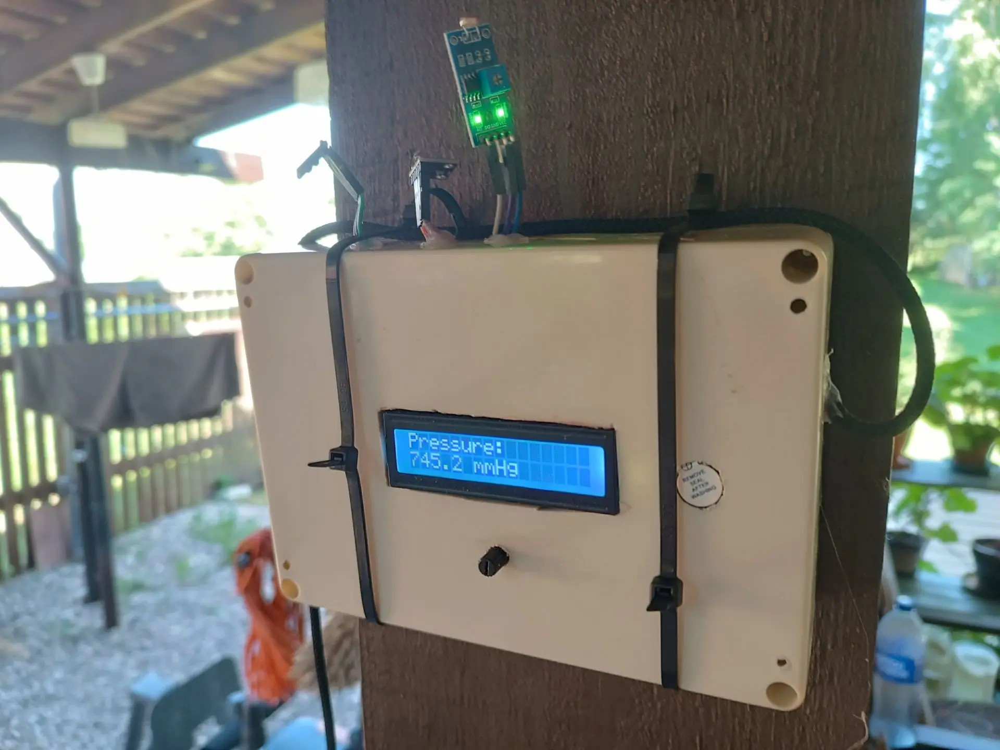

# Weather Station Advance

A comprehensive weather monitoring system using ESP32 with multiple sensors, LCD display, web interface, and real-time data visualization.

## Photo of the finished device





## Features

- Real-time monitoring of temperature, humidity, atmospheric pressure, and light levels
- 16x2 LCD display with potentiometer-controlled page navigation
- Web server with live charts and historical data visualization
- Data storage for last 24 readings (hourly intervals)
- Buzzer feedback for page changes
- NTP time synchronization

## Hardware Requirements

- ESP32 development board
- HTU21D temperature & humidity sensor
- BMP280 pressure sensor (address 0x76)
- 16x2 LCD with I2C interface (address 0x27)
- Photoresistor (analog light sensor)
- 10kΩ potentiometer
- Passive buzzer
- Connecting wires

## Wiring Diagram

Here's the wiring diagram table in English:

## Wiring Diagram Table

| **Component** | **ESP32 Pin** | **Purpose** | **Notes** |
|---------------|----------------|----------------|----------------|
| **LCD 1602 I2C Display** | | | |
| | 3.3V / 5V | VCC | Power (compatible with 5V) |
| | GND | GND | Common ground |
| | GPIO21 (SDA) | SDA | I2C data |
| | GPIO22 (SCL) | SCL | I2C clock |
| **HTU21D Sensor** | | | |
| | 3.3V | VIN | 3.3V power |
| | GND | GND | Ground |
| | GPIO21 (SDA) | SDA | I2C data (shared bus) |
| | GPIO22 (SCL) | SCL | I2C clock (shared bus) |
| **BMP280 Sensor** | | | |
| | 3.3V | VCC | 3.3V power |
| | GND | GND | Ground |
| | GPIO21 (SDA) | SDA | I2C data (shared bus) |
| | GPIO22 (SCL) | SCL | I2C clock (shared bus) |
| **Photoresistor (Light Sensor)** | | | |
| | 3.3V | - | Through 10kΩ resistor to GND (voltage divider) |
| | GPIO33 (ADC) | Signal | Analog input |
| | GND | GND | Common ground |
| **Potentiometer (10 kΩ)** | | | |
| | 3.3V | Left pin | Reference voltage |
| | GPIO35 (ADC) | Middle pin | Signal to ESP32 |
| | GND | Right pin | Ground |
| **Piezo Buzzer** | | | |
| | GPIO16 | + (anode) | PWM output |
| | GND | - (cathode) | Common ground |

### Power Connections

- **All I2C sensors**: VCC → 3.3V, GND → GND
- **LCD**: VCC → 5V (if supported) or 3.3V, GND → GND
- **Light Sensor**: VCC → 3.3V, GND → GND (with appropriate voltage divider)
- **Potentiometer**: Outer pins → 3.3V and GND, wiper → GPIO 35

## Libraries Required

Install via Arduino Library Manager:

- `LiquidCrystal_I2C` by Frank de Brabander
- `Adafruit HTU21DF` by Adafruit
- `Adafruit BMP280 Library` by Adafruit
- `ArduinoJson` by Benoit Blanchon

## Configuration

Update WiFi credentials in the code:

```cpp
const char* ssid = "your_wifi_ssid";
const char* password = "your_wifi_password";
```

## Usage

1. Upload code to ESP32
2. Open Serial Monitor (115200 baud) to verify connections
3. After WiFi connects, note the IP address displayed on LCD
4. Open web browser and navigate to `http://[ESP32_IP]`
5. Use potentiometer to navigate LCD pages:
   - Page 1: Title screen
   - Page 2: Temperature
   - Page 3: Humidity
   - Page 4: Pressure
   - Page 5: Light level

## Web Interface Features

- Current sensor readings with auto-refresh
- Interactive charts for all measurements
- Historical data for last 24 points
- Responsive design for mobile devices

## API Endpoints

- `GET /` - Main web dashboard
- `GET /api/data` - Current sensor readings (JSON)
- `GET /api/history` - Historical data (JSON)

## Notes

- Pressure is converted from hPa to mmHg for display
- Light readings are inverted (0 = dark, 100 = bright)
- Data is stored every hour
- NTP synchronization uses Moscow timezone (UTC+3)
